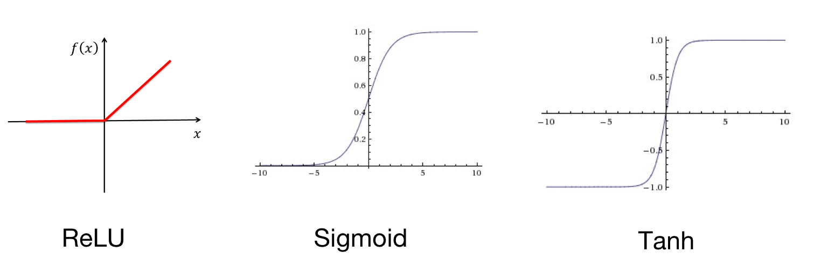

Messing around with opencv in python

# Installation

python3 -m pip install -r requirements.txt

# Developing

We use a virtual environment to do all our development in, this ensures that we don't import modules that accidentally
conflict with other project work. 

1. `python3 -m venv venv` - this will create your virtual environment inside a `venv` folder
2. `source venv/bin/activate` - this will activate your virtual env

## Adding new modules

New modules should be added to the virtual env with the following command: `pip install <module-name>`
After the module has been added you should update the `requirements.txt` file using: `pip freeze > requirements.txt`

If VSC is not linting or suggestions aren't working correctly then: 

1. press cmd + shift + p to bring up command palette and search for python: select interpreter
2. Pick then one which is associated with your virtual environment

# Part 1. Basic image manipulations:

- displaying (colour, grayscale,...)
- rotating
- resizing

code can be found in `src/basic_img_manipulations.py`

# Part 2. Plotting shapes

code can be found in `src/plotting_shapes.py`

# Part 3. Image pre-processing

We use a variety of techniques to prepare images for our models to achieve better results. To better understand this it's useful to take a step back and try to understand how we perceive images. 

What image do you see below? 

Do you see a face looking directly at you or perhaps you have focused on the snozz and noticed the man also appears to be shown in a sideways perspective. 

What about this one? The artist has managed to capture a 3D like effect with only a piece of pen and paper. 

If we are to understand images we can see that edges and contour detection is pretty important for our perception. 

There's also other things to consider when thinking about images. It's remarkable how we are able to tell 2 objects apart from one another and even identify the target amongst other objects in the background. Even toddlers are capable of recognising objects at different scale, colour and rotation however this is not a trivial task for a computer that often has a hard time trying to identify pixels which come from the object we want to label and the one in the background. 

Fortunately there are some steps which can make edge detection easier. 

## Blurring

Goal: Reduce noise
Why?: Images with high resolution often have information in the background we aren't interested in. Blurring can help reduce noise. It also helps mimic real life conditions. Not every picture is shot perfectly and in perfect lighting. Using blurred images as part of our dataset will help make our models more robust.

Warning: Blurring too much can cause data to be lost!

4 main types of blur: 

- Averaging
- Gaussian
- Median
- Bilateral

# CNN introduction

Convolution - Mathematical operation on 2 objects to produce an outcome that expresses how the shape of one is modified by the other. Convolution is using a kernel to extract certain features from an input image. 

Feature map - Is the output activations of a given feature applied on an image. 

Kernel - A 2D matrix which is slid across an image and multiplied with the input

Examples of convolution:

Why do we stack convolution layers?

It allows layers close to the input to learn low-level features (e.g. lines) and layers deeper into the model to learn high-order or more abstract features like shapes or specific objects. 

## Kernel vs filter

A filter is a concatenation of multiple kernels. Filters are always one dimensionality higher than the kernel and can be seen as multiple kernels stacked ontop of each other where every kernel is for a particular channel.
So in 2D convolutions, filters are 3D matrices. 

More info on different types of CNN [here](https://towardsdatascience.com/types-of-convolution-kernels-simplified-f040cb307c37).

## Padding and stride

Why?: Pixels at the corners of an image aren't calculated with the same amount of weighting as the center. If you apply convolution repeatedly you may lose this information.

Result: Gives addional pixels at the boundaries of the data. 

From the gif you can see that we move along one pixel at a time but we can change this number to be whatever we want. This is known as the stride. 

But why would we want to increase the stride? Surely that means we lose more information?

One of the limitations of the feature map is that it records precise positions of features in the input. Which means if the features of the image (e.g lines) were changed from some transformation (blurring, cropping, rotation etc.) then a different feature map would be produced. 

This is solved by a technique called down sampling which aims to capture the most important parts of the data without fine details. This is done by creating a lower resolution version of the input signal. Increasing the stride is one example of this but another popular method is called pooling.

## Pooling

A pooling layer is a new layer added after the convolutional layer. Specifically, after a nonlinearity (e.g. ReLU) has been applied to the feature maps output by a convolutional layer.

The addition of a pooling layer after the convolutional layer is a common pattern used for ordering layers within a convolutional neural network that may be repeated one or more times in a given model.

The pooling layer operates upon each feature map separately to create a new set of the same number of pooled feature maps.

Pooling involves selecting a pooling operation, much like a filter to be applied to feature maps. The size of the pooling operation or filter is smaller than the size of the feature map; specifically, it is almost always 2×2 pixels applied with a stride of 2 pixels.

This means that the pooling layer will always reduce the size of each feature map by a factor of 2, e.g. each dimension is halved, reducing the number of pixels or values in each feature map to one quarter the size. For example, a pooling layer applied to a feature map of 6×6 (36 pixels) will result in an output pooled feature map of 3×3 (9 pixels).

Average Pooling: Calculate the average value of each patch on the feature map. 
Max Pooling: Calculate the max value of each patch in the feature map. 

Pros:

- Improve translational invariance
- Downsampling: Reduce memory and computational cost
- Downsampling: Look more globally

The result of using a pooling layer and creating down sampled or pooled feature maps is a summarized version of the features detected in the input. They are useful as small changes in the location of the feature in the input detected by the convolutional layer will result in a pooled feature map with the feature in the same location. This capability added by pooling is called the model’s invariance to local translation.

"In all cases, pooling helps to make the representation become approximately invariant to small translations of the input. Invariance to translation means that if we translate the input by a small amount, the values of most of the pooled outputs do not change." - Deep Learning 2016

## Activation function

Theres a lot of different activation functions we can use e.g. sigmoid, tanh etc. but ReLU is the one that is typically used with CNN's.

Pros: 

- Faster convergence
- Easier and faster calculations
- Lower probability of vanishing gradient

Cons:

- Dying ReLU -> It can die if the inputs fall into the negative half (There are some other types of ReLU which can help solve this problem)

## Batch Normalization

Network is easier to train if the input is normalised (e.g. zero mean, unit variance). However in the CNN the paramaters are constantly changing which leads to data having a different distribution per layer. 

To solve this problem we introduce batch normalization. 

## Fully connected layers

The purpose of the fully connected layers is to flattern the output of the convolution layers to create a single long feature vector. Each output is connected to ALL flatterned features (hence the name fully connected layers).

